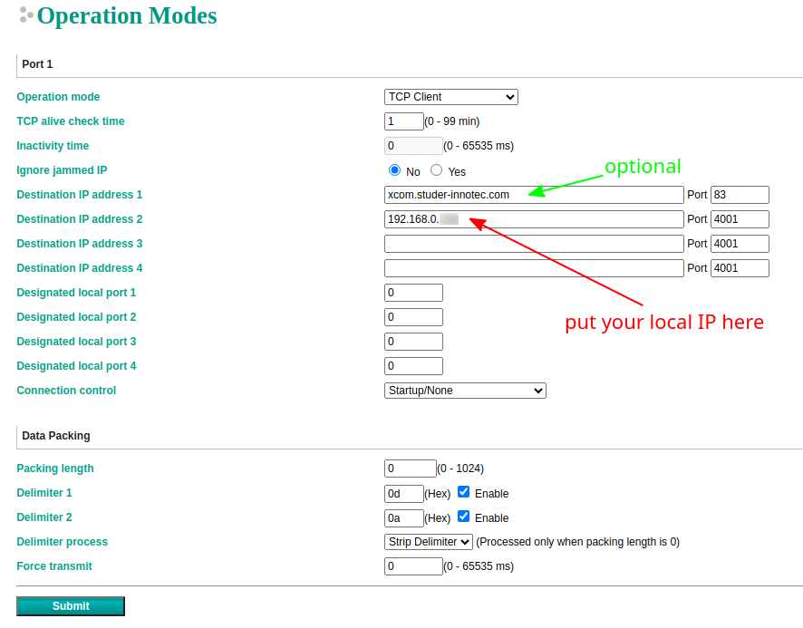
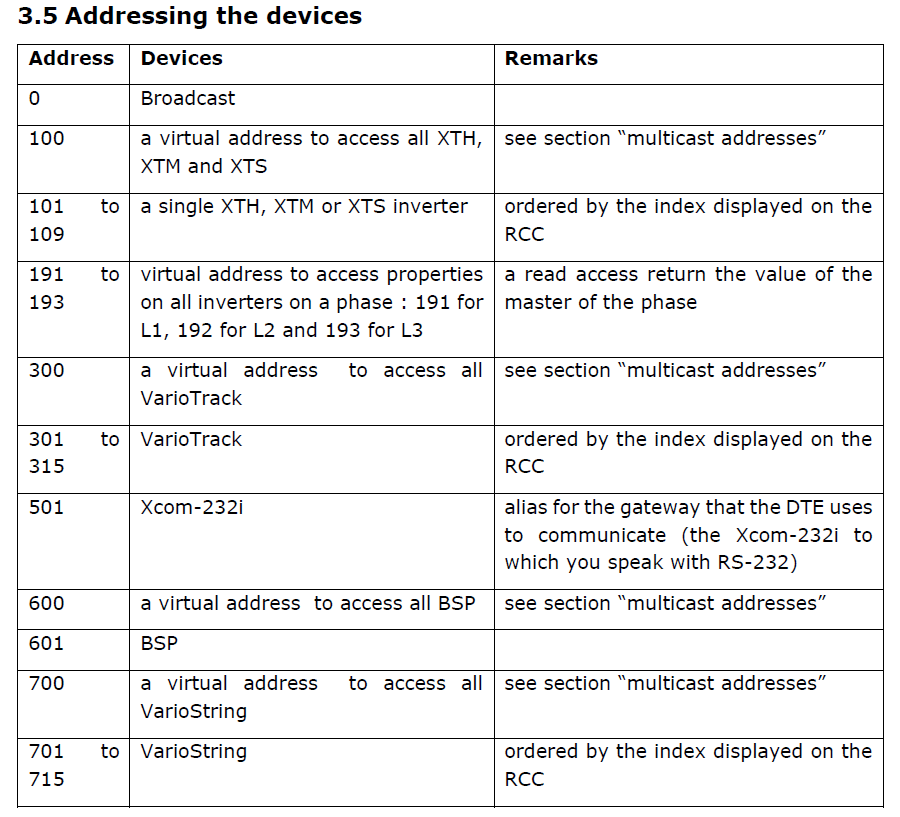

# homeassistant-studer-integration

Python library implementing Studer-Innotec Xcom protocol integration for Home Assistant via Xcom-232i and Xcom-LAN (TCP/UDP).

## About

This Home Assistant integration is based on the [xcom-protocol](https://github.com/zocker-160/xcom-protocol) library developed by zocker-160. It extends its functionality to provide native Home Assistant integration, allowing easy monitoring and control of your Studer devices directly from your Home Assistant interface.

## Hardware Setup

This integration requires the following hardware setup:
- A Raspberry Pi (any model with USB ports)
- A Studer Xcom-232i module
- A USB to Serial cable connecting the Raspberry Pi to the Xcom-232i

The Raspberry Pi acts as a bridge between your Studer inverter and Home Assistant. It should be:
1. Connected to your local network (for Home Assistant communication)
2. Connected via USB-Serial to the Xcom-232i module (for Studer device communication)

```
[Home Assistant] <-> [Raspberry Pi + This Integration] <-> [USB-Serial] <-> [Xcom-232i] <-> [Studer Device]
```

NOTE: This lib is still WiP, so functionality is still limited, but feel free to create a [pull request](https://github.com/zocker-160/xcom-protocol/pulls) if you want to contribute ;)

DISCLAIMER: This library is NOT officially made by Studer-Innotec.

The complete official documentation is available on: \
[Studer-Innotec Download Center](https://www.studer-innotec.com/en/downloads/) *-> Software and Updates -> Communication protocol Xcom-232i*

## Installation automatique sur Raspberry Pi

1. Clonez le dépôt :
```bash
git clone https://github.com/Jackylaviss/homeassistant-studer-integration.git
cd homeassistant-studer-integration
```

2. Rendez le script d'installation exécutable :
```bash
chmod +x install.sh
```

3. Exécutez le script d'installation :
```bash
sudo ./install.sh
```

Le script vous demandera :
- Le port série du Xcom-232i (par défaut : /dev/ttyUSB0)
- L'adresse IP du broker MQTT (par défaut : localhost)
- Le port MQTT (par défaut : 1883)
- Le nom d'utilisateur MQTT (par défaut : ha-mqtt)
- Le mot de passe MQTT (par défaut : ha-mqtt)

## Intégration avec Home Assistant

### Prérequis
- Home Assistant installé et fonctionnel
- Broker MQTT configuré dans Home Assistant
- Le service homeassistant-studer-integration installé et fonctionnel

### Configuration dans Home Assistant

1. Assurez-vous que l'intégration MQTT est activée dans Home Assistant
2. Copiez le fichier de configuration des capteurs :
```bash
# Sur votre Raspberry Pi
sudo cp /opt/homeassistant-studer-integration/homeassistant/xcom-sensors.yaml /config/
```

3. Ajoutez la ligne suivante à votre fichier `configuration.yaml` :
```yaml
sensor: !include xcom-sensors.yaml
```

4. Redémarrez Home Assistant

### Capteurs disponibles

Les capteurs suivants seront automatiquement créés dans Home Assistant :
- Puissance de sortie AC (W)
- Tension de la batterie (V)
- Courant de la batterie (A)
- État de charge de la batterie (%)
- Température de la batterie (°C)

### Personnalisation

Vous pouvez personnaliser l'affichage dans Home Assistant :
1. Allez dans Configuration → Personnalisation
2. Sélectionnez une entité Studer
3. Ajoutez une icône, un nom personnalisé ou d'autres attributs

### Tableau de bord suggéré

Vous pouvez créer un tableau de bord dédié avec ces éléments :
```yaml
title: Système Studer
cards:
  - type: entities
    title: État du système
    entities:
      - sensor.studer_battery_state_of_charge
      - sensor.studer_battery_voltage
      - sensor.studer_battery_current
      - sensor.studer_battery_temperature
      - sensor.studer_ac_power_output
  
  - type: gauge
    title: État de charge batterie
    entity: sensor.studer_battery_state_of_charge
    min: 0
    max: 100
    
  - type: history-graph
    title: Historique batterie
    entities:
      - sensor.studer_battery_voltage
      - sensor.studer_battery_current
```

## Que fait le script d'installation ?

1. Installe les dépendances nécessaires
2. Clone le dépôt dans /opt/homeassistant-studer-integration
3. Crée un fichier de configuration avec vos paramètres
4. Configure un service systemd pour le démarrage automatique
5. Démarre le service

## Commandes utiles

- Voir l'état du service : `sudo systemctl status homeassistant-studer-integration`
- Voir les logs en temps réel : `sudo journalctl -u homeassistant-studer-integration -f`
- Redémarrer le service : `sudo systemctl restart homeassistant-studer-integration`
- Arrêter le service : `sudo systemctl stop homeassistant-studer-integration`
- Désactiver le démarrage automatique : `sudo systemctl disable homeassistant-studer-integration`

## Getting Started

### Requirements
#### Hardware

- Xcom-232i or Xcom-LAN connected to your installation
- Xcom-232i connected to PC using USB to RS-232 adapter (1) or PC in same local network as Xcom-LAN device
- PC with at least USB2.0 or faster (works on Raspberry Pi 3/4 as well)

(1) I personally am successfully using an adapter with the PL2303 chipset like [this one](https://www.amazon.de/dp/B00QUZY4UG)

#### Software

- any Linux based OS (x86 / ARM)
- python3 >= 3.9
- python3-pip

### Installation

```bash
pip install homeassistant-studer-integration
```
#### Important

- make sure you select the USB to RS-232 adapter as the `serialDevice`, usually on Linux it is `/dev/ttyUSB[0-9]`
- when using Xcom-LAN UDP make sure MOXA is set up properly and reachable via a static IP in the local network
- when using Xcom-LAN TCP make sure your device IP is static, reachable in the local network and specified in the MOXA

### MOXA Setup for Xcom-LAN TCP


- address to Studer Portal is optional and can be removed if you don't need their web interface
- `Data Packing` has to be set exactly as shown, you will get `AssertionError` otherwise

#### Important
If you want Studer Portal to still keep working, make sure you wait for at least 5 - 10 seconds to give it time to send data.

### Adressing Devices

Make sure you are setting the correct destination Address `dstAddr` otherwise read / write operations might not work.

By default `getValue` and `setValue` use the address `100`, which is a multicast address for all XTH, XTM and XTS devices, it does NOT include VarioTrack, VarioString or BSP.

Furthermore if you have more than one device of each type (VarioString, VarioTrack, XTS etc.) then using the multicast address is probably not desired either.

**NOTE:** for code examples see below

All used addresses of Studer devices can be found in the Studer documentation (page 8, section 3.5):


## Examples
### Reading values

```python
from xcom_proto import XcomP as param
from xcom_proto import XcomC
from xcom_proto import XcomRS232
from xcom_proto import XcomLANUDP

xcom = XcomRS232(serialDevice="/dev/ttyUSB0", baudrate=115200)
# OR (default ports are 4002 and 4001)
xcom = XcomLANUDP("192.168.178.110")
# OR overwriting ports
xcom = XcomLANUDP("192.168.178.110", dstPort=4002, srcPort=4001)

boostValue = xcom.getValue(param.SMART_BOOST_LIMIT)

pvmode = xcom.getValue(param.PV_OPERATION_MODE)
pvpower = xcom.getValue(param.PV_POWER) * 1000 # convert from kW to W
sunhours = xcom.getValue(param.PV_SUN_HOURS_CURR_DAY)
energyProd = xcom.getValue(param.PV_ENERGY_CURR_DAY)

soc = xcom.getValue(param.BATT_SOC)
battPhase = xcom.getValue(param.BATT_CYCLE_PHASE)
battCurr = xcom.getValue(param.BATT_CURRENT)
battVolt = xcom.getValue(param.BATT_VOLTAGE)

# please look into the official Studer parameter documentation to find out
# what type a parameter has
pvmode_manual = xcom.getValueByID(11016, XcomC.TYPE_SHORT_ENUM)

# using custom dstAddr (can also be used for getValueByID())
solarPowerVS1 = xcom.getValue(param.VS_PV_POWER, dstAddr=701)
solarPowerVS2 = xcom.getValue(param.VS_PV_POWER, dstAddr=702)

print(boostValue, pvmode, pvpower, sunhours, energyProd, soc, battPhase, battCurr, battVolt)
```

#### XcomLAN TCP

```python
from xcom_proto import XcomP as param
from xcom_proto import XcomC
from xcom_proto import XcomRS232
from xcom_proto import XcomLANTCP

with XcomLANTCP(port=4001) as xcom:
    boostValue = xcom.getValue(param.SMART_BOOST_LIMIT)
    # same as above
```

### Writing values

**IMPORTANT**:
`setValue()` and `setValueByID()` have an optional named parameter `propertyID` which you can pass either:

- `XcomC.QSP_UNSAVED_VALUE`: writes value into RAM only (default when not specified)
- `XcomC.QSP_VALUE`: writes value into flash memory; **you should write into flash only if you *really* need it, write cycles are limited!**

```python
from xcom_proto import XcomP as param
from xcom_proto import XcomC
from xcom_proto import XcomRS232
from xcom_proto import XcomLANUDP

xcom = XcomRS232(serialDevice="/dev/ttyUSB0", baudrate=115200)
# OR (default ports are 4002 and 4001)
xcom = XcomLANUDP("192.168.178.110")
# OR overwriting ports
xcom = XcomLANUDP("192.168.178.110", dstPort=4002, srcPort=4001)

xcom.setValue(param.SMART_BOOST_LIMIT, 100) # writes into RAM
xcom.setValue(param.FORCE_NEW_CYCLE, 1, propertyID=XcomC.QSP_VALUE) # writes into flash memory

# using custom dstAddr
xcom.setValue(param.BATTERY_CHARGE_CURR, 2, dstAddr=101) # writes into RAM
xcom.setValue(param.BATTERY_CHARGE_CURR, 2, dstAddr=101, propertyID=XcomC.QSP_VALUE) # writes into flash memory

# using custom value by ID
xcom.setValueByID(1107, XcomC.TYPE_FLOAT, 30) # writes into RAM
xcom.setValueByID(1107, XcomC.TYPE_FLOAT, 30, propertyID=XcomC.QSP_VALUE) # writes into flash memory

# using custom value by ID and dstAddr
xcom.setValueByID(1107, XcomC.TYPE_FLOAT, 30, dstAddr=101) # writes into RAM
xcom.setValueByID(1107, XcomC.TYPE_FLOAT, 30, dstAddr=101, propertyID=XcomC.QSP_VALUE) # writes into flash memory
```

#### XcomLAN TCP

```python
from xcom_proto import XcomP as param
from xcom_proto import XcomC
from xcom_proto import XcomRS232
from xcom_proto import XcomLANTCP

with XcomLANTCP(port=4001) as xcom:
    xcom.setValue(param.SMART_BOOST_LIMIT, 100) # writes into RAM
    xcom.setValue(param.FORCE_NEW_CYCLE, 1, propertyID=XcomC.QSP_VALUE) # writes into flash memory
    # same as above
```

## Troubleshooting
### Writing value returns `Permission Denied` error

Usually this is caused by using the default multicast address to write values that are not part of the default address range. See [above](#adressing-devices) for more information.

### `AssertionError` (invalid header / frame)

Usually this is caused by a wrong MOXA setup when using UDP / TCP, make sure `Data Packing` is set correctly in the MOXA. See [above](#moxa-setup-for-xcom-lan-tcp) for more information.

When using Xcom-232i then checksum errors and AssertionErrors can be caused by a bad RS232 connection or a wrong BAUD rate setting.

## Dépannage

Si le service ne démarre pas :
1. Vérifiez les logs : `sudo journalctl -u homeassistant-studer-integration -f`
2. Vérifiez que le port série est correct : `ls -l /dev/ttyUSB*`
3. Vérifiez les permissions du port série : `sudo chmod 666 /dev/ttyUSB0`
4. Vérifiez la connexion MQTT : `mosquitto_sub -h localhost -t "#" -u votre_user -P votre_password`

## Contribution

N'hésitez pas à créer une [pull request](https://github.com/Jackylaviss/homeassistant-studer-integration/pulls) si vous souhaitez contribuer au projet.
